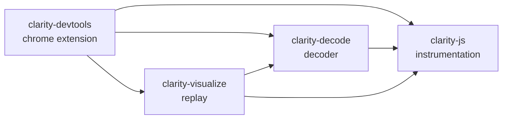
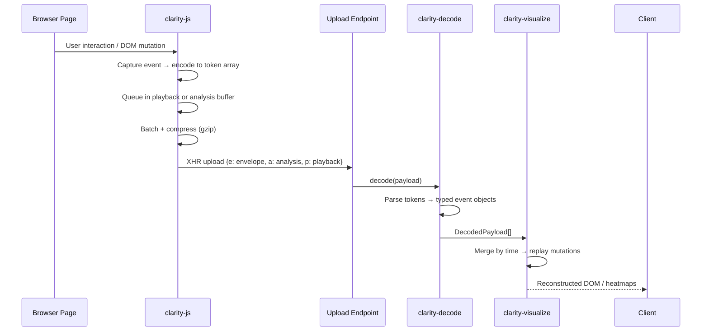
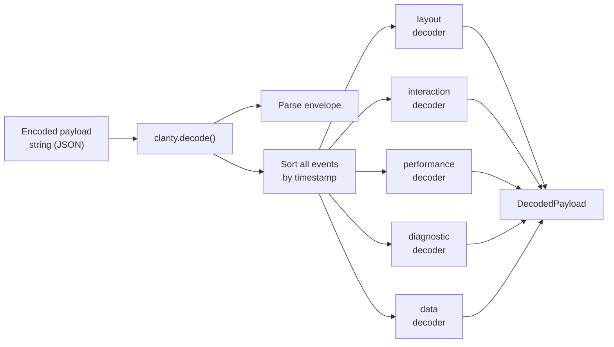
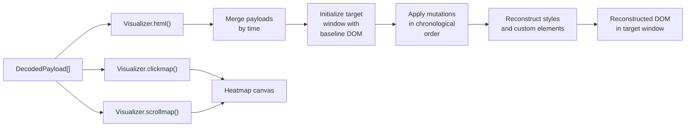
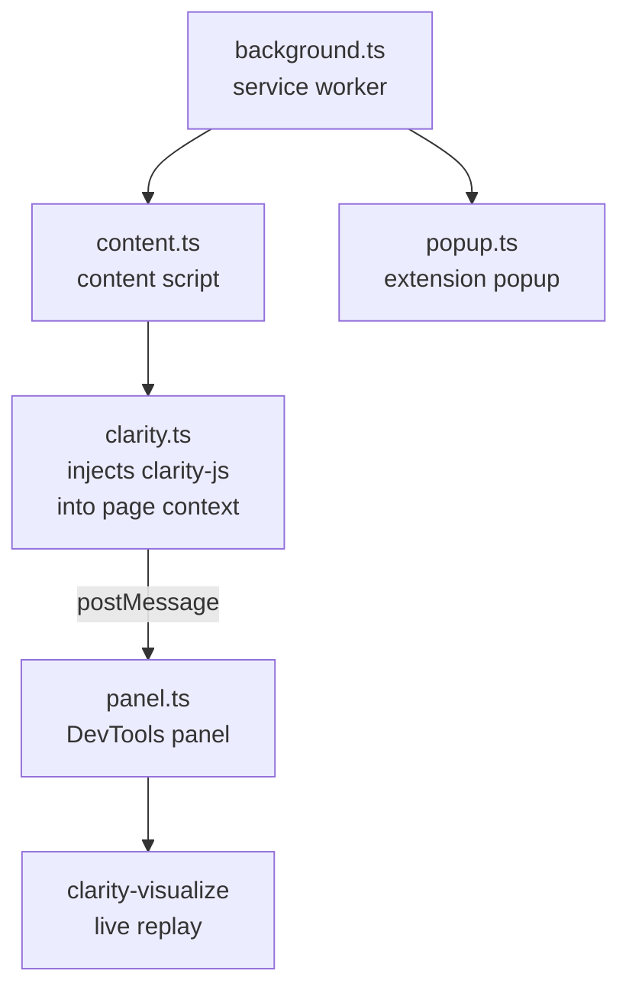

# Clarity Architecture

## Overview

Clarity is a behavioral analytics library that captures user interactions and DOM state in a browser, transmits compressed event payloads to a server, and enables pixel-perfect session replay. It is structured as a TypeScript monorepo with four packages that form a linear processing pipeline.

## Package Dependency Chain



| Package | Role |
|---|---|
| `clarity-js` | Runs on the monitored website. Captures DOM, interactions, and performance data and uploads encoded payloads. |
| `clarity-decode` | Decodes encoded payloads back into structured typed events. Runs server-side or in tooling. |
| `clarity-visualize` | Reconstructs a pixel-perfect session replay from decoded payloads. |
| `clarity-devtools` | Chrome DevTools extension. Injects clarity-js, receives live data, and renders real-time replay in the DevTools panel. |

---

## End-to-End Data Flow



---

## clarity-js

clarity-js is organized into modules, each responsible for a domain of data collection. Every module exposes `start()` and `stop()`, and most also expose an `encode(event, time?)` function that converts captured state into token arrays for upload.

### Module Initialization Order

Modules start in dependency order when `clarity.start()` is called:

1. **core** — config, event binding, task scheduler, version
2. **data** — envelope, upload pipeline, metadata, cookie, session identity
3. **diagnostic** — script error tracking, fraud detection
4. **layout** — DOM discovery, MutationObserver, stylesheets, shadow DOM
5. **interaction** — clicks, scroll, pointer, input, timeline
6. **performance** — Navigation Timing API, Web Vitals
7. **dynamic** — third-party platform integrations (loaded on demand)

### Source Structure

| Module | Key Files | Responsibility |
|---|---|---|
| `core/` | `config.ts`, `task.ts`, `event.ts`, `version.ts`, `history.ts` | Global config, async task scheduler, event binding registry, SPA navigation detection |
| `data/` | `upload.ts`, `envelope.ts`, `compress.ts`, `metadata.ts`, `cookie.ts`, `baseline.ts` | Payload batching, compression, XHR/beacon upload, session identity |
| `layout/` | `discover.ts`, `mutation.ts`, `dom.ts`, `style.ts`, `region.ts`, `animation.ts` | Initial DOM walk, MutationObserver, stylesheet tracking, shadow DOM |
| `interaction/` | `click.ts`, `pointer.ts`, `scroll.ts`, `input.ts`, `timeline.ts`, `submit.ts` | All user interaction events |
| `performance/` | `navigation.ts`, `observer.ts` | Navigation Timing API, Web Vitals, resource timing |
| `diagnostic/` | `script.ts`, `fraud.ts`, `internal.ts` | Script errors, fraud checksums, internal logging |
| `insight/` | `blank.ts`, `snapshot.ts`, `encode.ts` | Stub implementations for lightweight build variants |
| `dynamic/` | `agent/tidio.ts`, `agent/crisp.ts`, `agent/livechat.ts` | Third-party platform integrations |

### The Encode Pattern

Every module that produces events follows the same pattern:

1. **Capture** — event listeners or MutationObserver callbacks populate a module-level `state` object
2. **Encode** — `encode(eventType, time?)` is called, reading from `state` and flattening into a token array
3. **Queue** — the token array is passed to `upload.queue(tokens)` for batched transmission

Token arrays are flat arrays of primitives `(string | number | boolean | null)`. Every array starts with `[timestamp, eventType, ...eventData]`. This format is compact, schema-free, and compresses extremely well with gzip.

**Example — Click event token array:**
```
[ time, Event.Click, targetId, x, y, eX, eY, button, reaction, context,
  linkText, linkUrl, selectorHash, trust, isFullText, width, height,
  tag, class, id, source ]
```

**Example — Mutation event token array:**
```
[ time, Event.Mutation, nodeId, parentId, prevSiblingId,
  tagName, "attr1=value1", "attr2=value2", textContent, ... ]
```

### Payload Structure

Every upload is a single JSON object with three top-level keys. Each value is an array of token arrays.

#### Envelope (`e`)

Always present. Contains session identity and context for every payload.

| Field | Description |
|---|---|
| `version` | Library version |
| `sequence` | Monotonically increasing payload counter |
| `sessionId` | Session identifier |
| `projectId` | Clarity project ID |
| `userId` | Anonymous user identifier |
| `url` | Page URL at time of upload |
| `duration` | Elapsed ms since session start |
| `timestamp` | Wall clock time of upload |

#### Analysis payload (`a`)

Aggregated metrics and analytics data. Always sent, even in lean mode.

| Event group | Events |
|---|---|
| Session & page | `Baseline`, `Page`, `Ping`, `Unload`, `Upgrade`, `Consent` |
| Metrics & dimensions | `Metric`, `Dimension`, `Variable`, `Custom`, `Extract`, `Signal` |
| Interactions | `Click`, `DoubleClick`, `ContextMenu`, `Scroll`, `Resize`, `MouseMove`, `MouseDown`, `MouseUp`, `MouseWheel`, `TouchStart`, `TouchEnd`, `TouchMove`, `TouchCancel`, `Input`, `Change`, `Submit`, `Clipboard`, `Selection`, `Focus`, `Visibility` |
| Performance | `Navigation`, `Timeline` |
| Diagnostics | `ScriptError`, `Log`, `Fraud`, `Upload`, `Limit`, `Summary` |
| Regions | `Region` |

#### Playback payload (`p`)

DOM state and mutations needed for session replay. Conditionally sent — suppressed in lean mode once the 10 MB playback byte limit is reached, and stripped from beacon payloads over 64 KB.

| Event group | Events |
|---|---|
| DOM structure | `Discover`, `Mutation`, `Snapshot` |
| Styles | `StyleSheetAdoption`, `StyleSheetUpdate` |
| Animations | `Animation` |
| Custom elements | `CustomElement` |

### Upload System

#### XHR vs sendBeacon

| Scenario | Transport | Notes |
|---|---|---|
| Normal mid-session payload | XHR | Compressed (gzip), `Accept: application/x-clarity-gzip` header, 15s timeout |
| Final payload (page unload) | sendBeacon first, XHR fallback | sendBeacon has no retry; XHR used if beacon fails or payload > 64 KB |
| Retry attempt | XHR (uncompressed) | Retried as plain JSON string, not compressed |

#### Retry Logic

- **Retry limit:** 1 retry per payload
- **Retries on:** status 0, 5XX, and other non-success codes
- **No retry on:** 4XX (client error) — triggers immediate shutdown via `Check.Server`
- **Fallback URL:** If primary upload returns status 0 on the first attempt and `config.fallback` is set, the fallback URL is tried before the retry counter increments
- **Status 0 exhausted:** One final sendBeacon attempt before triggering `Check.Retry` shutdown

#### Payload Size Limits

| Limit | Value | Effect |
|---|---|---|
| First payload max | 1 MB | Playback data withheld from sequence 0 if over limit; sent in sequence 1+ |
| Beacon max | 64 KB | Playback (`p`) stripped from final payload to fit; only `e` + `a` sent |
| Lean mode playback cap | 10 MB | Once exceeded, all further playback events discarded for session |

#### Adaptive Delay

Upload timing adapts based on session state:

- If DOM discovery bytes are pending: minimum delay (100 ms) — upload as fast as possible
- Otherwise: `sequence × config.delay`, capped at 30 seconds
- If using a custom upload callback instead of a URL: always uses `config.delay` directly

#### Server Response Handling

The server can send back commands in the response body:

| Command | Effect |
|---|---|
| `END` | Shut down clarity-js for this session |
| `UPGRADE` | Switch to full playback mode (fire `config.upgrade` callback) |
| `ACTION` | Fire `config.action` callback with key |
| `EXTRACT` | Trigger data extraction |
| `SIGNAL` | Custom signal |
| `MODULE` | Load a dynamic module |
| `SNAPSHOT` | Capture a DOM snapshot |

### Build Variants

clarity-js produces multiple bundles from a single source. The rollup alias plugin swaps active modules for blank stubs at build time — no runtime conditionals, no bundle size overhead.

#### Module inclusion by variant

| Module | `min.js` | `extended.js` | `insight.js` | `performance.js` | `livechat.js` | `tidio.js` | `crisp.js` |
|---|:---:|:---:|:---:|:---:|:---:|:---:|:---:|
| core | ✓ | ✓ | ✓ | ✓ | — | — | — |
| data | ✓ | ✓ | ✓ | ✓ | — | — | — |
| layout (full) | ✓ | ✓ | — | — | — | — | — |
| layout (snapshot only) | — | — | ✓ | — | — | — | — |
| interaction (full) | ✓ | ✓ | — | — | — | — | — |
| interaction (click/scroll only) | — | — | ✓ | — | — | — | — |
| performance | ✓ | ✓ | — | ✓ | — | — | — |
| diagnostic | ✓ | ✓ | ✓ | — | — | — | — |
| dynamic/agent (livechat) | — | — | — | — | ✓ | — | — |
| dynamic/agent (tidio) | — | — | — | — | — | ✓ | — |
| dynamic/agent (crisp) | — | — | — | — | — | — | ✓ |

#### Output formats

Each main variant also ships as CJS (`clarity.js`) and ESM (`clarity.module.js`) for bundler consumption.

### Privacy & Masking

#### How privacy levels are assigned

Each DOM node is assigned a privacy level that determines how its content is handled before transmission.

**Priority order (highest wins):**

1. `config.drop[]` CSS selectors — node excluded entirely (`Exclude`)
2. `config.mask[]` CSS selectors — content masked as `TextImage`
3. `config.unmask[]` CSS selectors — content captured as-is (`None`)
4. Element type defaults (see table below)
5. Inherited from parent node

**Default privacy levels by element type:**

| Element | Default Level | Reason |
|---|---|---|
| `<input type="password">` | `Exclude` | Always excluded — never captured |
| `<input>`, `<textarea>`, `<select>` | `Text` | Form fields masked by default |
| ``, `<video>`, `<canvas>`, `<svg>` | `TextImage` | Visual content masked |
| `<script>`, `<style>`, `<link>` | `Exclude` | Not useful for replay |
| Most other elements | `None` | Captured as-is |

#### Privacy levels

| Level | Text content | Images | Node captured |
|---|---|---|---|
| `None` | As-is | As-is | Yes |
| `Sensitive` | Masked | As-is | Yes |
| `Text` | Replaced with `•` characters | As-is | Yes |
| `TextImage` | Replaced with `•` characters | Replaced with placeholder | Yes |
| `Exclude` | — | — | No — node dropped entirely |
| `Snapshot` | As-is | As-is | Static snapshot only, no mutations |

#### Configuration options

```typescript
config.mask    = ["input.sensitive", ".pii"];   // Force TextImage on these selectors
config.unmask  = [".public-text"];              // Override masking on these selectors
config.drop    = [".chat-widget", "#sidebar"];  // Exclude completely
config.content = false;                         // Disable all text capture globally
```

### Monkey Patching

clarity-js wraps a small set of native browser APIs to capture events that are not observable through standard event listeners. All patches follow the same safeguards:

- The original method is saved before wrapping
- The wrapper calls the original (clarity never replaces behavior, only observes)
- An `if (core.active())` guard skips tracking overhead when clarity is stopped
- Idempotency checks prevent double-wrapping if `start()` is called twice
- Patches that may be read-only (e.g. on Safari iOS) are wrapped in try-catch

#### Patches applied

| Native API | File | Why standard events are insufficient |
|---|---|---|
| `history.pushState` | `core/history.ts` | No browser event fires on pushState; needed to detect SPA route changes |
| `history.replaceState` | `core/history.ts` | Same as pushState |
| `Element.prototype.animate` | `layout/animation.ts` | Web Animations API creates animations imperatively with no observable event |
| `Animation.prototype.play` | `layout/animation.ts` | Animation state transitions are not DOM events |
| `Animation.prototype.pause` | `layout/animation.ts` | Same as play |
| `Animation.prototype.cancel` | `layout/animation.ts` | Same as play |
| `Animation.prototype.finish` | `layout/animation.ts` | Same as play |
| `Animation.prototype.commitStyles` | `layout/animation.ts` | Same as play |
| `CSSStyleSheet.prototype.insertRule` | `layout/mutation.ts` | CSS rule injection bypasses MutationObserver |
| `CSSMediaRule.prototype.insertRule` | `layout/mutation.ts` | CSS rule injection inside media queries also bypasses MutationObserver |
| `CSSStyleSheet.prototype.deleteRule` | `layout/mutation.ts` | Same as insertRule |
| `CSSMediaRule.prototype.deleteRule` | `layout/mutation.ts` | Same as insertRule |
| `Element.prototype.attachShadow` | `layout/mutation.ts` | Shadow roots are created imperatively; no event fires to observe them |
| `CSSStyleSheet.prototype.replace` | `layout/style.ts` | Constructable Stylesheets (adopted stylesheets) bypass MutationObserver |
| `CSSStyleSheet.prototype.replaceSync` | `layout/style.ts` | Same as replace |
| `customElements.define` | `layout/custom.ts` | Custom element registration is not observable via standard APIs |

**What is NOT patched:** `fetch`, `XMLHttpRequest`, `addEventListener`, `dispatchEvent`. Clarity observes the DOM and user interaction only — it does not intercept or monitor network traffic made by the page.

### Configuration Reference

Full `Config` interface from `types/core.d.ts`:

#### Network & upload

| Option | Type | Description |
|---|---|---|
| `upload` | `string \| UploadCallback` | Upload endpoint URL, or custom callback `(payload: string) => void` |
| `fallback` | `string?` | Secondary upload URL tried if primary returns status 0 (browser-blocked) |
| `report` | `string?` | Separate endpoint for error/diagnostic reporting |
| `delay` | `number?` | Base milliseconds between upload batches |

#### Data collection

| Option | Type | Description |
|---|---|---|
| `projectId` | `string?` | Clarity project ID for server routing |
| `track` | `boolean?` | Master on/off for data collection |
| `content` | `boolean?` | Include text content in DOM events (subject to privacy rules) |
| `lean` | `boolean?` | Drop playback events once 10 MB limit hit; keep only analytics |
| `lite` | `boolean?` | Lighter instrumentation footprint from session start |
| `fraud` | `boolean?` | Enable fraud detection via form field checksums |
| `diagnostics` | `boolean?` | Enable internal diagnostic logging |
| `conversions` | `boolean?` | Enable structured data extraction (schema.org, OpenGraph) |
| `modules` | `string[]?` | Dynamic modules to load (e.g. `["tidio", "crisp"]`) |

#### Privacy

| Option | Type | Description |
|---|---|---|
| `mask` | `string[]?` | CSS selectors whose content is masked as `TextImage` |
| `unmask` | `string[]?` | CSS selectors exempt from masking |
| `drop` | `string[]?` | CSS selectors excluded from capture entirely |
| `cookies` | `string[]?` | Cookie names to extract and include (requires user consent) |

#### Performance tuning

| Option | Type | Description |
|---|---|---|
| `delayDom` | `boolean?` | Defer DOM instrumentation until page is interactive |
| `throttleDom` | `boolean?` | Batch and throttle MutationObserver callbacks |

#### Regions & extraction

| Option | Type | Description |
|---|---|---|
| `regions` | `Region[]?` | Named regions `[id, "css selector"]` for viewability tracking |
| `checksum` | `Checksum[]?` | Manual fraud checksums `[fraudId, "css selector"]` |
| `dob` | `number?` | Date of birth (ms since epoch) for age-based analytics dimensions |
| `includeSubdomains` | `boolean?` | Extend session cookie to subdomains |

#### Callbacks

| Option | Type | Description |
|---|---|---|
| `upgrade` | `(key: string) => void?` | Called when server requests upgrade to playback mode |
| `action` | `(key: string) => void?` | Called for server-sent `ACTION` commands |

### Performance Considerations

| Technique | Where | Purpose |
|---|---|---|
| `requestIdleCallback` task queue | `core/task.ts` | Avoid blocking main thread during DOM discovery |
| Event throttling | `interaction/scroll.ts`, `layout/mutation.ts` | Reduce event volume on noisy interactions |
| Token array encoding | All `encode.ts` files | Compact wire format, high gzip compression ratio |
| Lean mode | `data/upload.ts` | Disables playback data after byte limit to cap payload size |
| `sendBeacon` on unload | `data/upload.ts` | Reliable final payload delivery without blocking page unload |
| Build-time tree shaking | `rollup.config.ts` | Variant bundles replace unused modules with blank stubs |
| Async DOM discovery | `layout/discover.ts` | Initial DOM walk deferred via high-priority idle task |

---

## clarity-decode

clarity-decode is a lightweight decoder library that runs server-side or in tooling. It takes the raw encoded payload string produced by clarity-js and reconstructs it into structured, typed event objects grouped by category. It is the entry point for any downstream processing, replay, or analysis.



Version compatibility is enforced: major and minor versions must match between encoder and decoder; patch versions are tolerated.

---

## clarity-visualize

clarity-visualize takes decoded payloads from clarity-decode and reconstructs a pixel-perfect session replay inside a target browser window. It merges events from multiple payloads by timestamp, replays DOM mutations in order, and can generate click and scroll heatmaps from the same data.



The `Visualizer` class exposes `html()` for replay, `clickmap()` / `scrollmap()` for heatmaps, and `merge()` for combining multi-payload sessions.

---

## clarity-devtools

clarity-devtools is a Chrome/Edge DevTools extension that ties all three packages together for local debugging. It injects clarity-js directly into any webpage, captures the live data stream via postMessage, and renders a real-time session replay inside the DevTools panel — all without sending any data to a remote server.



Data never leaves the user's device when using the DevTools extension — it is passed via `postMessage` between page and panel contexts.

---

## See Also

- [AGENTS.md](./AGENTS.md) — build commands, dev workflow, coding standards
- [CONTRIBUTING.md](./CONTRIBUTING.md) — environment setup and contribution guide
- [README.md](./README.md) — project overview
